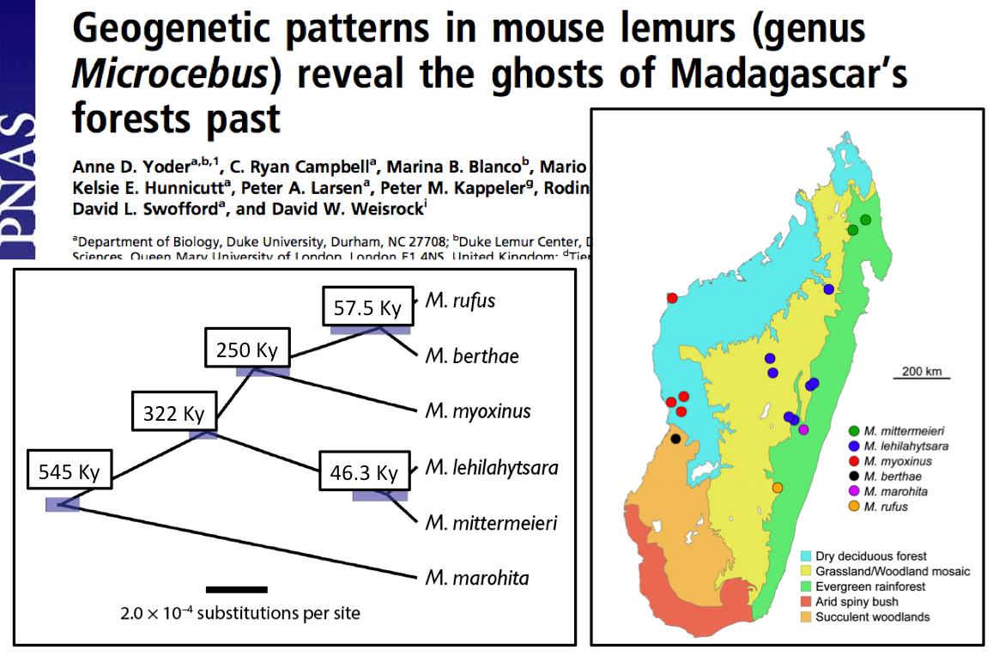

# Calibrating coalescent trees to geological time

A tutorial on estimating mouse lemur divergence times and population sizes using RADseq data and the multi-species coalescent.

File `R/mcmc.txt` contains an MCMC sample from the posterior distribution of tau (coalescent branch lengths) and theta (ancestral scaled population sizes) for a fixed tree of six mouse lemur species.
 
File `R/analysis.R` contains an R script that uses `R/mcmc.txt` as input to convert the coalescent branch lengths (tau) into geological times of divergence, and to convert teh scaled population sizes (theta) into actual effective population sizes (i.e., in numbe of individuals). 

A detailed explanation is given in http://bit.ly/mousies

Directory `bpp/` contains the necessary files to run an A00 analysis with BPP to obtain an MCMC sample for tau and theta under the multi-species coalescent.

